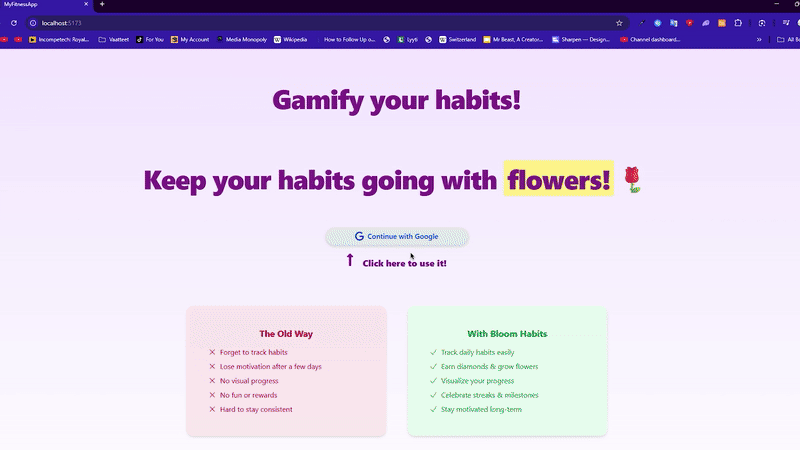

<h1>📚 My Fitness App</h1>
<h2>Technologies: React, Node.js, Express, MongoDB, Passport.js, Tailwind, DaisyUI, Open Food Facts API</h2>

Live Demo: 

Users can:

- Log in ready-made/custom habits
- Log in their foods + adjust daily calories
- Get experience points and diamonds
- Use diamonds to buy flowers and plant them on a flowerfield

What did I learn?
  
- How to design and build a backend API for a real-world application.
- How to connect a server to a database and manage data effectively.
- How to structure project files and organize backend code properly.
- How to handle user authentication and secure routes.
- How to manage relationships between different types of data.
- How to validate incoming data to ensure the app runs reliably.
- How to handle errors and provide useful responses to the client.
- How to debug, test, and improve the backend logic.
- How to think through the full request-response cycle in a web app.
- How to style with Tailwind, MaterialUI & DaisyUI
